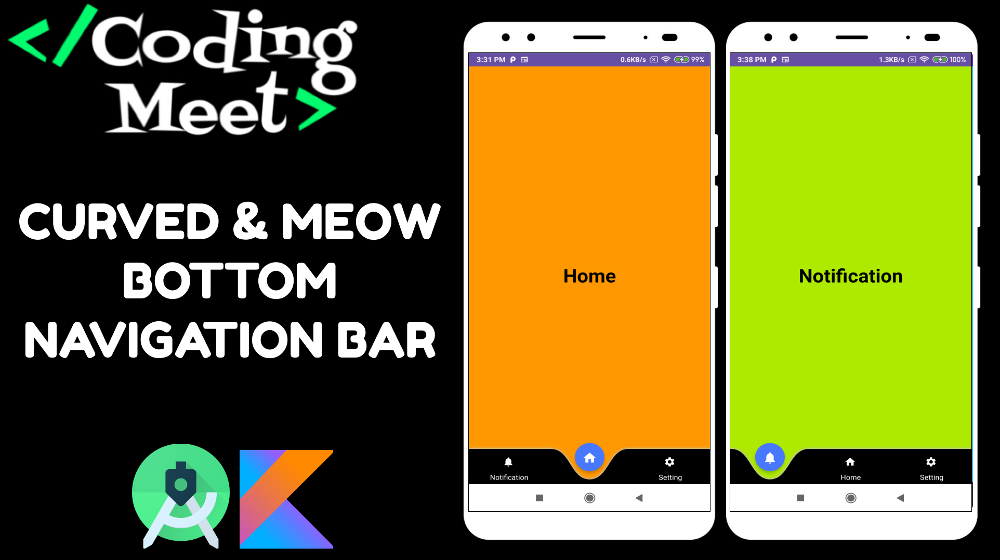

# Curved-Bottom-Navigation-App
How to Implement Curved and Meow Bottom Navigation Bar in Android Studio Kotlin

# [YouTube Video Link](https://youtu.be/4PaNE5QH2B8)

## Support the Project

If you find this tutorial series helpful and would like to support the development of more content, consider buying me a coffee! Your support helps in creating high-quality tutorials.

Your generosity is greatly appreciated! Thank you for supporting this project.
